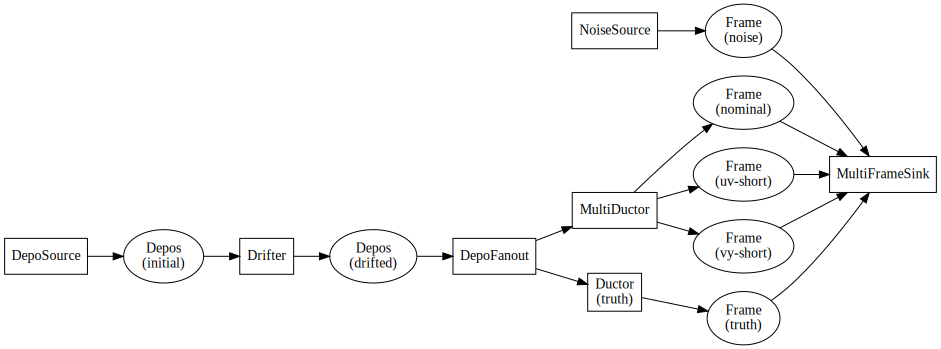
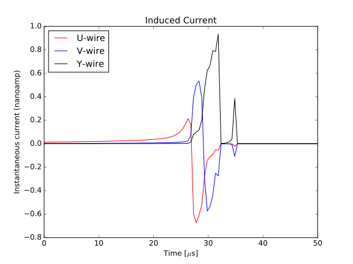
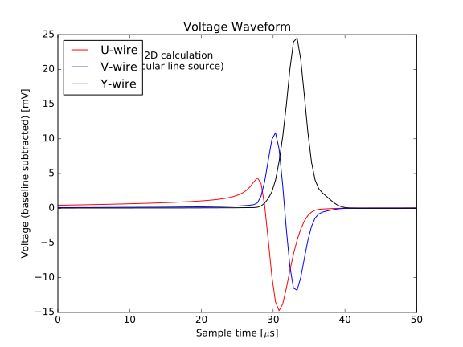
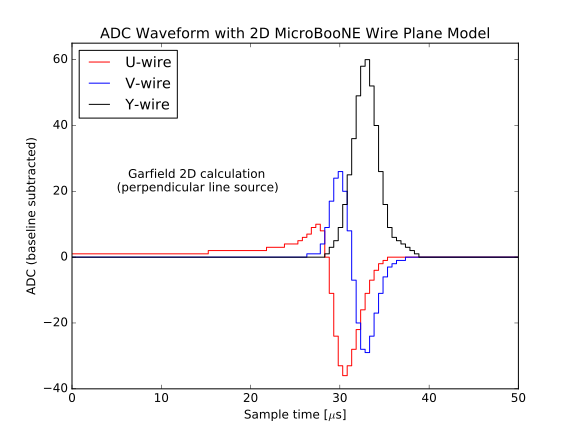
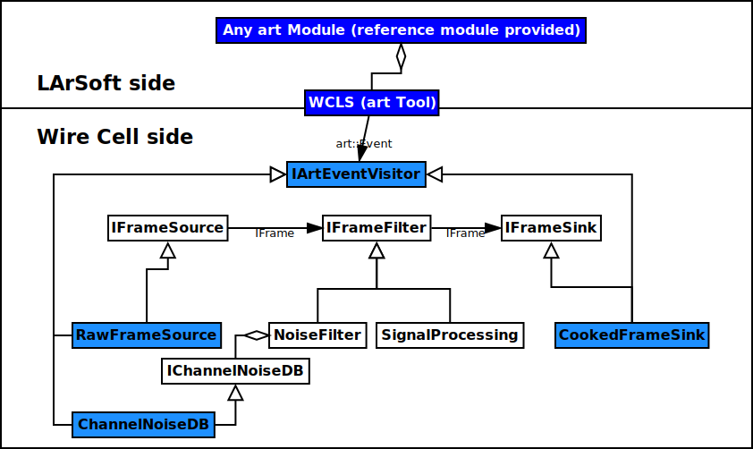

- [Installation](#installation)
  - [Toolkit installation](#toolkit-installation)
    - [Source code](#source-code)
    - [Configuring the source](#configuring-the-source)
    - [Building the source](#building-the-source)
    - [Install the results](#install-built-code)
    - [Running unit tests](#running-unit-tests)
    - [Other build commands](#other-build-commands)
  - [Runtime environment](#runtime-environment)
  - [Guide for installation of dependencies](#installing-dependencies)
    - [Manual Installation of Externals](#manual-externals-install)
    - [Singularity containers and CVMFS](#singularity-cvmfs-externals)
    - [Automated Installation with Spack](#spack-installed-externals)
    - [Externals provided by UPS](#using-externals-from-ups)
  - [Release management](#release-management)
    - [Release versions](#release-versions)
    - [Branch policy](#branch-policy)
    - [Branch mechanics](#branch-mechanics)
- [Configuration](#configuration)
  - [Introduction](#configuration-introduction)
  - [Configuration from a user point of view](#user-configuration)
    - [File formats](#configuration-file-formats)
    - [Basic command line](#configuration-command-line)
    - [Diving into JSON](#diving-into-json)
    - [Limitations of JSON](#json-limitations)
    - [Learning Jsonnet](#learning-jsonnet)
    - [Specific detector support](#configuration-for-specific-detectors)
    - [Using the `jsonnet` command line program](#jsonnet-command-line)
  - [Configuration from a developer point of view](#developer-configuration)
- [Howtos](#howtos)
  - [Install wire-cell with singularity container](#install-wire-cell-with-singularity-container)
    - [A) singularity and cvmfs](#a-singularity-and-cvmfs)
    - [B) wcdo](#b-wcdo)
  - [Run `wire-cell` command line program](#run-wire-cell-cli)
  - [Add a new component class](#add-a-component)
    - [Conceptual design](#component-concept)
    - [Estimating dependencies](#component-dependencies)
    - [Selecting a package](#component-package)
    - [Selecting interfaces](#component-interfaces)
    - [Component header](#component-header)
    - [Component implementation](#component-implementation)
- [Internals](#internals)
  - [Toolkit packages](#toolkit-packages)
    - [Names](#package-names)
    - [Dependencies](#package-dependencies)
    - [Package structure](#package-structure)
    - [Build package](#build-package)
    - [Adding a new code package](#add-new-package-to-build)
  - [Coding conventions](#coding-conventions)
    - [C++ code formatting](#c++-code-formatting)
    - [C++ namespaces](#c++-namespaces)
    - [Configuration Parameters](#configuration-conventions)
  - [Interfaces](#interface-internals)
  - [Components](#component-internals)
  - [Configuration](#configuration-internals)
  - [Execution Models](#execution-models)
    - [Ad-hoc](#ad-hoc-execution)
    - [Concrete](#execution-concrete-components)
    - [Interface](#execution-via-interfaces)
    - [Data flow programming execution](#dfp-execution)
  - [Logging](#logging)
    - [Logging Command Line Interface](#logging-cli)
    - [Logging Code Interface](#logging-code)
    - [Logging Integration](#logging-int)
- [Packages](#packages)
  - [`wire-cell-python`](#pkg-python)
    - [Installing `wire-cell-python`](#install-wire-cell-python)
    - [Python command line programs](#python-programs)
    - [`wirecell` Python modules](#python-modules)
  - [`wire-cell-util`](#pkg-util)
    - [Units](#util-units)
    - [Persistence](#util-persistence)
    - [Etc](#org531e5e8)
  - [`wire-cell-iface`](#pkg-iface)
    - [Data](#org438ce1e)
    - [Nodes](#orgbc79ed0)
    - [Misc](#orgffc091a)
  - [`wire-cell-gen`](#pkg-gen)
    - [Depositions](#orgcef4386)
    - [Drifting](#org12303b4)
    - [Response](#orgc3b71e4)
    - [Digitizing](#orgc047466)
    - [Noise](#orgd682037)
    - [Frame Summing](#orgb8f7bcc)
    - [Execution Graphs](#org81e64ce)
  - [`wire-cell-waftools`](#pkg-waftools)
    - [Recreating `wcb`](#generate-wcb)
    - [Included Waf tools](#bundle-waf-tools)
    - [The main `wscript`](#main-wscript)
- [Data Flow Programming](#data-flow-programming)
  - [Node basics](#orgf538228)
  - [Node execution paradigms](#org6932ca4)
  - [DFP execution strategies](#orgd9c0aa3)
  - [End-of-stream Protocol](#org0570845)
- [Other Topics](#other-topics)
  - [Garfield 2D Support](#garfield-2d-support)
    - [Garfield 2D data](#garfield-2d-data)
    - [Preprocessing of Garfield 2D data](#preprocessing-garfield-data)
    - [Eyeballing Garfield 2D with `wirecell.sigproc.garfield`](#eyeball-garfield)
    - [Validation plots](#garfield-validation-plots)
    - [Producing WCT Field Response Data File](#convert-garfield-data-to-json)
  - [Running inside of art/LArSoft](#larsoft-integration)
    - [Overview](#wcls-overview)
    - [Design](#wcls-design)
    - [Configuration](#wcls-config)
    - [Runtime](#wcls-run)
    - [Development](#wcls-dev)


<a id="installation"></a>

# Installation

The Wire Cell Toolkit (WCT) should be easy to build on any POSIX&rsquo;y system with a recent C++ compiler. This section describes how to build releases and development branches, it gives guidance for supplying the few software dependencies, and documents how releases are made.


<a id="toolkit-installation"></a>

## Toolkit installation

<div class="warning">
This assumes you already have available the required dependencies. See section [1.3](#installing-dependencies).

</div>

Installation requires four steps:

1.  get the source
2.  configure the source
3.  build the code
4.  install the results


<a id="source-code"></a>

### Source code

WCT source is composed of several packages (see section [5](#packages)) and all source is available from the [Wire Cell GitHub organization](https://github.com/WireCell/). Releases of each package are made and documented on GitHub (*eg* [here](https://github.com/WireCell/wire-cell-toolkit/releases)) and can be downloaded as archives. However, using git to assemble a working source area is recommended and easier. Releases and development branches are handled slightly differently.

To obtain a release requires no GitHub authentication:

    $ git clone --branch 0.5.x \
          https://github.com/WireCell/wire-cell-toolkit.git

This gets the tip of a release branch (the `0.5.x` series in this example). A specific point release can then be checked out:

    $ git checkout -b 0.5.0 0.5.0

To contribute new development to the toolkit, even as a &ldquo;core&rdquo; developer, it&rsquo;s recommended to *fork* the `wire-cell-toolkit` repository on GitHub, do your work there and make GitHub Pull Requests (PR). This gives an opportunity for other developers to give a quick check on new code.

Core developers can nonetheless directly push to the central repository. It&rsquo;s suggested to do so via an SSH authenticated clone:

    $ git clone git@github.com:WireCell/wire-cell-toolkit.git wct


<a id="configuring-the-source"></a>

### Configuring the source

Prior to building, the source must be configured to specify an installation location and provide options to direct how to find external software dependencies and/or to select which optional dependencies. More details on the build system are in <./waftools.md>.

On systems where software dependencies can be auto-detected, the configuration step may be as simple as:

    $ ./wcb configure \
       --prefix=/path/to/install

This will print the results of the attempts to detect required and optional dependencies. Missing but optional dependencies will not cause failure. See below for guidance on installing dependencies if this step fails or if desired optional dependencies are not found.

Dependencies may be automatically located if `pkg-config` is available and possibly by suitably setting the `PKG_CONFIG_PATH` environment variable. If automatic location fails then missing locations can be explicitly specified. The following shows an example where all externals are installed at a single location identified by the `WCT_EXTERNALS` environment variable (not, this variable has no other special meaning other than to make this example brief).

    $ ./wcb configure \
       --prefix=/path/to/install \
       --boost-includes=$WCT_EXTERNALS/include \
       --boost-libs=$WCT_EXTERNALS/lib --boost-mt \
       --with-root=$WCT_EXTERNALS \
       --with-fftw=$WCT_EXTERNALS \
       --with-eigen=$WCT_EXTERNALS \
       --with-jsoncpp=$WCT_EXTERNALS \
       --with-jsonnet=$WCT_EXTERNALS \
       --with-tbb=$WCT_EXTERNALS

If the externals are not all in one directory then their locations must be accordingly specified individually.


<a id="building-the-source"></a>

### Building the source

It is suggested to first build the code before running tests.

    $ ./wcb -p --notests

If there are build failures more information can be obtained by repeating the build with more verbosity:

    $ ./wcb -vv


<a id="install-built-code"></a>

### Install the results

To install the build results into the location given by `--prefix` simply issue:

    $ ./wcb install --notests


<a id="running-unit-tests"></a>

### Running unit tests

<div class="note">
Unit tests are meant to be small, focused tests. More elaborate tests may be found in the [wire-cell-validate](https://github.com/wirecell/wire-cell-validate) package.

</div>

Tests are run by default by `./wcb` unless `--notests` is given. Running the tests can take a while but should be run on new installations and after any significant development. The developers should not leave broken tests so any failure should be treated as important. However, some tests require proper user environment to run correctly. In particular, tests need to find some Wire-Cell configuration files and the executable programs and shared libraries of the external software dependencies need to be located. Below shows an example:

    $ export WIRECELL_PATH=$HOME/dev/wct/wire-cell-data:$HOME/dev/wct/wire-cell-toolkit/cfg
    $ export LD_LIBRARY_PATH=$HOME/dev/wct/install/lib:$HOME/opt/jsonnet/lib
    $ ./wcb -p --alltests
    ...
    execution summary 
      tests that pass 83/83
        ... 
      tests that fail 0/83 
    'build' finished successfully (15.192s)

<div class="INFO">
Developers wishing to run unit tests that exercise code they are developing should take care in setting `LD_LIBRARY_PATH`. If the WCT installation area is included then the unit tests will run against those libraries, effectively masking the locally built versions in the development area. Alternatively, they must run `./wcb install` and then manually re-run the unit test.

</div>


<a id="other-build-commands"></a>

### Other build commands

These other commands may be useful:

    $ ./wcb clean          # clean build products
    $ ./wcb distclean      # also clean configuration
                           # build with debug symbols  
    $ ./wcb configure --build-debug=-ggdb3 [...]
                           # to save some time, just 
                           # rebuild the given test 
                           # and don't run any tests
    $ ./wcb --notests --target=test_xxx
    $ ./wcb --help         # see more options.


<a id="runtime-environment"></a>

## Runtime environment

Managing environment is usually a personal choice or computer facility policy and WCT does not place any significant requirements on this. The usual setting of `PATH` like variables will likely be needed.

Internally, WCT requires a minimum of environment variables:

-   **`WIRECELL_PATH`:** a list of directories to search when locating configuration files. More information is in the section [2](#configuration).


<a id="installing-dependencies"></a>

## Guide for installation of dependencies

The WCT depends on a number of third-party &ldquo;external&rdquo; software packages which are not expected to be provided by a typical unix-like system:

-   **Boost:** various functions
-   **Eigen3:** matrix representation, interface to FFTW
-   **FFTW3:** for fast Fast Fourier Transforms
-   **JsonCPP:** basis for configuration and input data files
-   **Jsonnet:** structured configuration files.

Additional, optional package are needed for additional functionality:

-   **ROOT:** for the `root/` sub-package, not required for core code
-   **TBB:** for parallel, multi-threaded data flow programming paradigm support
-   **CUDA:** support for some GPU technologies

<div class="note">
This list may not represent current reality. To get a full, up-to-date list of what packages WCT can use run `./wcb --help`.

</div>

The following subsections gives some guidance for obtaining these &ldquo;external&rdquo; packages.


<a id="manual-externals-install"></a>

### Manual Installation of Externals

In the DIY mode, the installer is free to provide the third-party packages in any convenient way. Many of them are available on well supported operating systems such as Debian/Ubuntu. Homebrew for Mac OS X is not a core developer platform but may provide many. Redhat derived Linux distributions may find suitable package on EPEL. Most of the required packages are fairly easy to build from source.

However the installer decides to build in DIY-mode the WCT build system should be able to be given proper installation locations via the `--with-*` flags as described above. If it seems not to be the case, please contact the developers.


<a id="singularity-cvmfs-externals"></a>

### Singularity containers and CVMFS

One mostly &ldquo;turn key&rdquo; sway to provide an environment for WCT development and running is to use Singularity containers possibly augmented with CVMFS. Instructions and support can be found in the [wire-cell-singularity](https://github.com/WireCell/wire-cell-singularity) package.


<a id="spack-installed-externals"></a>

### Automated Installation with Spack

[Spack](https://github.com/LLNL/spack) is a &ldquo;meta build system&rdquo; that runs the individual build systems that come with packages. It allows one to manage an ever growing installation area which can accommodate multiple versions of a package. It also comes with support for [Environment Modules](http://modules.sourceforge.net/) to handle your users&rsquo; setup of these packages or can make targeted release &ldquo;views&rdquo; of its package tree.

WCT provides a package [wire-cell-spack](https://github.com/WireCell/wire-cell-spack) which collects instructions and an Spack &ldquo;repo&rdquo; that builds WCT and its third-party dependencies. This leverages Spacks built-in &ldquo;repo&rdquo; to provide dependencies needed by WCT&rsquo;s direct dependencies. Using it will tend to build packages that one may already have installed through the OS (eg, Python). However, this duplication should not add much to the overall build time which is automatic nor lead to any problems.

An installer that wishes to use wire-cell-spack to provide the dependencies should begin by following its [README](https://github.com/WireCell/wire-cell-spack/blob/master/README.org) file.


<a id="using-externals-from-ups"></a>

### Externals provided by UPS

Fermi National Accelerator Lab (FNAL) uses a user environment system similar to [Environment Modules](http://modules.sourceforge.net/). It is typical to download binaries provided by FNAL, either manually of automatically via a CVMFS mount, and then use the UPS shell function `setup` to configure a user environment with many environment variables. For each package (&ldquo;UPS product&rdquo;) that is so setup there is a variable that gives the installation location. These can be used to provide suitable values for the `--with-*` flags to `wcb` as described above. The source provides a script `waftools/wct-configure-for-ups.sh` which may help run `./wcb configure` in such an environment.


<a id="release-management"></a>

## Release management

Releases are made by developers as needed and as described in this section.


<a id="release-versions"></a>

### Release versions

WCT label releases are made following a fixed procedure. Releases are labeled with the common three-number convention: `X.Y.Z`. These take the following semantic meanings:

-   **X:** a major release is made when developers believe some substantial milestone has been achieved or to being wholly new or a globally breaking development path.
-   **Y:** a minor or feature release is made when substantial new and in particular any breaking development is made.
-   **Z:** a bug release fixes problems without otherwise substantial changes.


<a id="branch-policy"></a>

### Branch policy

Any new major or minor releases produce a new Git branch in each package. Only bug fixes are made to this branch. Where applicable, release bug fixes should be applied to `master`. Nominally, all development is on the `master` branch however developers are free to make their own feature branches. They are encourage to do this if their development is expected to be disruptive to other developers.


<a id="branch-mechanics"></a>

### Branch mechanics

To make releases, the above details are baked into two test scripts [make-release.sh](https://github.com/WireCell/waf-tools/blob/master/make-release.sh) and [test-release.sh](https://github.com/WireCell/waf-tools/blob/master/test-release.sh). See comments at the top of each for how to run them. These scripts can be used by others but are meant for developers to make official releases.


<a id="configuration"></a>

# Configuration

As the Wire Cell Toolkit (WCT) is a toolkit, it is up to the parent application to provide some mechanism for the user to provide configuration information to WCT *components*. Users should refer to the application&rsquo;s documentation for details. This section of the manual documents the configuration mechanism that is provided by WCT itself. If an application decides to use the WCT file format then its users may refer to this document. Developers of WCT components should read it as well.


<a id="configuration-introduction"></a>

## Introduction

WCT itself provides a mechanism which is exposed to the user by the `wire-cell` command line application. Any application may easily adopt this same mechanism by making use of the `WireCell::ConfigManager` class.

This WCT configuration mechanism is described here from the point of view of **user** and **developer**. Details for each role are given in the following sections. However, both user and developer must understand one aspect of WCT internal design in order to understand configuration: A WCT application is composed of a number of *component* classes. Components work together in some way to enact the job of the application. A component is specifically a C++ class which implements one or more *interface* base classes. One interface pertinent here is `IConfigurable`. A component that implements this interface is called a *configurable component* or just *configurable*. A configurable then is the atomic unit of WCT configuration and this unit is reflected in what the user provides for configuration and what developers should expect if they write configurable components.

The user then provides an ordered sequence of *configuration objects* or simply *configurations*. Each configuration is associated (by WCT) with exactly one *instance* of a configurable component class. This association is done via two string identifiers:

-   **type:** specifies the &ldquo;configurable type&rdquo; which often matches the C++ class name with any C++ namespace removed. However, developers of configurable components are free to chose any unique type name.

-   **name:** specifies a &ldquo;configurable instance&rdquo;, that is an C++ object instance of the C++ class associated with the configurable type identifier. The name is free form and may be omitted in which case it defaults to the empty string. A specific name is needed if multiple instances are required or if multiple configurables require sharing a component.

<div class="note">
A type/name pair is are also used to initially construct and later locate any instance of a WCT component (not just configurable components).

</div>

Finally, configurations have a third attribute:

-   **data:** specifies a data structure following a schema specific to the configurable type. This is the &ldquo;payload&rdquo; that WCT gives to the instance of the configurable component.

In the next section, WCT user-configuration support is described. After it, the following section gives guidance to developers who wish to write their own configurable components.


<a id="user-configuration"></a>

## Configuration from a user point of view     :user:

Users of the WCT command line interface `wire-cell` (or any WCT application that uses `WireCell::ConfigManager`) can provide configuration information in the form of one or more files. These files express the ordered configuration sequence that is conceptually described above.


<a id="configuration-file-formats"></a>

### File formats

WCT supports two related configuration file formats: [JSON](http://www.json.org/) and [Jsonnet](http://jsonnet.org/). Of the two, JSON is more fundamental while the Jsonnet data templating language provides a powerful way to organize and construct complex configurations. Jsonnet files are compiled into JSON by WCT and the result is then fed to the WCT configurable components.


<a id="configuration-command-line"></a>

### Basic command line

A user gives one or more configuration files to the `wire-cell` application each with a `-c` flag:

    $ wire-cell -c myparameters.cfg [...]

If a relative path is given, the file will be searched for starting in the current working directory and then in each directory listed in a `WIRECELL_PATH` environment variable, if given. When multiple configuration are used, their top-level arrays are conceptually concatenated in the order on which they are given on the command line.


<a id="diving-into-json"></a>

### Diving into JSON

An example JSON configuration for a single component might look like:

```js
[
   {
      "data" : {
	 "clight" : 1,
	 "step_size" : 0.10000000000000001,
	 "tracks" : []
      },
      "name" : "",
      "type" : "TrackDepos"
   }
]
```

Here we see an array holding one element which is an object with the `type`, (instance) `name` and payload data= structure as described above. If `wire-cell` were to load this configuration it would create a default instance of the component type `TrackDepos` which happens to correspond to the C++ class `WireCell::Gen::TrackDepos` (see the [simulation package manual](./gen.md) for more information). This component is responsible for produces deposition (`IDepo`) objects using a simple linear source model.

The `tracks` array in this example is empty and no depositions would be produced. The user most certainly should specify a nonempty set of tracks. In principle, the user may produces a huge `tracks` array. WCT support bzip2 compressed JSON files (see the section on [persistence in the util package manual](./util.md)).


<a id="json-limitations"></a>

### Limitations of JSON

As the complexity of a `wire-cell` job grows, hand crafting JSON becomes tedious and error prone. Splitting the files and/or using `WIRECELL_PATH` can provide some rudimentary means of organizing a large, complex configuration.

However, a user will quickly outgrow direct authoring of JSON files. An accomplished user will likely turn to some form of JSON generation using a more expressive language maybe by developing some scripts. Or, some part of a configuration may need to be extracted or converted from another source. For example, Geant4 steps might be extracted and formatted into a `TrackDepos` configuration as a long `tracks` array.

Another limitation is that any numerical quantities **must** be expressed in the base units used by the WCT *system of units* (see the section on [units in the Utilities manual](./util.md)). This places a burden on the configuration author and is a source of error.

The user is free to generate JSON in any manner they wish as long as the result conforms to the required schema. However, WCT provides a second, more powerful JSON-like configuration file format which described next.


<a id="learning-jsonnet"></a>

### Learning Jsonnet

WCT provides support for configuration files following the [Jsonnet data templating language](http://jsonnet.org/). This language is evaluated to produce JSON. WCT can evaluation Jsonnet files directly. The user may also install the `jsonnet` command line program which is useful for validating Jsonnet files. Either the valid Jsonnet or the JSON it produces may be given to WCT.

To learn how to write Jsonnet in general, the user should refer to its documentation which is excellent. There are many ways to structure Jsonnet and the [wire-cell-cfg](https://github.com/wirecell/wire-cell-cfg) package provides a number of examples. It also provides support files that can help the user craft their configuration in Jsonnet. In particular the WCT system of units and some common data structures used by WCT are exported to Jsonnet in [wirecell.jsonnet](https://github.com/WireCell/wire-cell-cfg/blob/master/wirecell.jsonnet). Some of this exported functionality is illustrated below.

WCT locates Jsonnet files as it does JSON files through the environment variable `WIRECELL_PATH`. Unlike JSON files, Jsonnet files may not be compressed.


#### System of units

Wire Cell provides an internal system of units as described in the section on [units in the Utilities manual](./util.md) and as stated above, users must take care to give numerical quantities in WCT units when providing JSON. However, when writing Jsonnet one can provide explicit units which is easy and far less error prone. For example:

```js
local wc = import "wirecell.jsonnet";
[
    {
	type:"TrackDepos",
	data: {
	    step_size: 1.0 * wc.millimeter,
	    // or could abreviate with wc.mm
	}
    }
]
```


#### Functions

Some data sub-structures are needed in multiple laces and it can be laborious to write them by hand. Jsonnet provides functions to assist in this. A number of functions are defined to assist in representing common data types. For example `point()` and `ray()`:

```js
{
  // ...
  tracks : [ wc.ray(wc.point(10,0,0,wc.cm),
	     wc.point(100,10,10,wc.cm)) ]
},
```


#### Default parameters

It is typical that different components must share common values, or separate values which derive from common values. Jsonnet allows for this to be expressed in the configuration in a simple manner. For example, in the `gen` package both `Drifter` and `Ductor` may apply statistical fluctuations. For debugging it can be useful to turn this feature off. This can be done in a consistent manner like in a global parameter file

```js
// in uboone/globals.json
{
    // ...
    // True if simulation should do fluctuations
    fluctuate: true,
    // ...
}
```

This file can then be imported so that this variable may be applied where ever it is needed.

```js
// in uboone/components.jsonnet
local params = import "uboone/globals.jsonnet";
{
    // ...
    drifter: {
	type : "Drifter",
	data : {
	    // ... other parameters ...
	    fluctuate : params.fluctuate,
	}
    },
    ductor: {
	type : 'Ductor',
	data : {
	    // ... other parameters ...
	    fluctuate : params.fluctuate,
	}
    },        
    // ...
}
```

See next how these definitions are used.


#### Default structures

One useful way to factor a configuration is to have one Jsonnet file which holds default values and one or more that customize on top of those defaults. For example one the [MicroBooNE configuration](https://github.com/WireCell/wire-cell-cfg/tree/master/uboone) provided by `wire-cell-cfg` defines a default configuration for the `FourDee` WCT app.

<div class="note">
An &ldquo;app&rdquo; is a top level main class run by WCT while an &ldquo;application&rdquo; refers to a program built with WCT that a user runs.

</div>

This app is configured with a list of components to use for certain portions of the &ldquo;FourDee&rdquo; simulation. By default these can are configured with the default types provided directly in the `gen` package. Note, these configuration are generally in the form `"TypeName:InstanceName"` but the defaults to not specify an instance name.

```js
// in uboone/components.json
{
    // ...
    fourdee : {
	type : 'FourDee',
	data : {
	    DepoSource: "TrackDepos",
	    Drifter: "Drifter",
	    Ductor: "Ductor",
	    Dissonance: "SilentNoise",
	    Digitizer: "Digitizer",
	    FrameSink: "DumpFrames",            
	},
    },
    // ...
}
```

The default type for `FrameSink` is given as `DumpFrames`. This component just prints a little bit of info to the terminal. The user probably wants to be able to save the result of the simulation in some more useful way. The [simple I/O](https://github.com/WireCell/wire-cell-sio) package provides a `FrameSink` which will save the resulting simulated waveforms as 2D ROOT histograms. The user merely needs to override `FrameSink` like:

```js
// assumes user has this directory in their WIRECELL_PATH
local uboone = import "uboone/components.jsonnet";
[
    // ... skip other overrides ...

    uboone.fourdee {
	data : super.data {
	    FrameSink: "HistFrameSink",            
	}
    },
]
```

This says to override `uboone.fourdee` with what&rsquo;s given. The `type` is inherited. The `data` is replaced by the parent&rsquo;s via `super.data` plus the additional override of the `FrameSink` attribute.


#### Commas

One of the most irritating aspect of crafting JSON files by hand is that any array or object must **not** have an internal trailing comma. Jsonnet allows this otherwise extraneous comma, as shown in the example above. For this reason alone and if no other features are used, writing Jsonnet instead of raw JSON is worth the added dependency!


<a id="configuration-for-specific-detectors"></a>

### Specific detector support

The `wire-cell-cfg` package also provides support for popular LArTPC detectors. You can find these files under a directory named for the experiment (such as [that for MicroBooNE](https://github.com/WireCell/wire-cell-cfg/tree/master/uboone)).


<a id="jsonnet-command-line"></a>

### Using the `jsonnet` command line program

Jsonnet&rsquo;s command line program `jsonnet` is fast and gives good error messages. It&rsquo;s often easiest to develop a Jsonnet configuration using it for periodic validating. Assuming the current working directory is the top of the WCT source then running the following:

    $ jsonnet -J cfg cfg/uboone/fourdee.jsonnet

should reward you with a big screen full of JSON. You can then run `wire-cell` something like:

    $ wire-cell -c uboone/fourdee.jsonnet

This relies on the `WIRECELL_PATH` to include the `cfg/` directory as well as any other directories holding any configuration data files referenced by the configuration.


<a id="developer-configuration"></a>

## TODO Configuration from a developer point of view     :devel:

For the C++ part of developing WCT components or applications the developer should refer to the [configuration section in the manual on WCT Internals](./internals.md) and the [section on configuration implementation](#component-configuration).

In addition, a developer is encouraged to provide Jsonnet files that abstract away any less important details and give users a simplified way to configure the developers components.

In particular, if the developer writes multiple components, an application component or a component that refers to another component, working example configuration files should be provided.


<a id="howtos"></a>

# Howtos

This section of the manual gives brief guidance on how to do various things with WCT.


<a id="install-wire-cell-with-singularity-container"></a>

## Install wire-cell with singularity container

This is a markdown version of Wenqiang&rsquo;s google doc [here](https://docs.google.com/document/d/1cXfifmLUx6UroHm66uJRzG1PEYJ7jLFNRA1LDZ7y5ls/edit), with some updates that works on July 10th 2019 for the following versions:

-   larsoft version: `v08_24_00`
-   larwirecell version: `v08_05_08`
-   wirecell: `v0_12_3`
-   Check [this](https://cdcvs.fnal.gov/redmine/projects/larwirecell/repository) for the latest version


<a id="a-singularity-and-cvmfs"></a>

### A) singularity and cvmfs

Install singlularity and cvmfs following [this](https://github.com/WireCell/wire-cell-singularity).


<a id="b-wcdo"></a>

### B) wcdo

This step-by-setp guide showed an example of using wcdo. For more, refer [this](https://github.com/WireCell/wire-cell-singularity/blob/master/wcdo.org)


#### B.1) Obain and configure a singularity image

```sh
mkdir -p ~/wcdo/example
cd ~/wcdo/example
wcdo.sh init
wcdo.sh wct
wcdo.sh get-image sl7krb
wcdo.sh make-project myproj sl7krb
vim wcdo-local-myproj.rc
wcdo_mrb_project_name="larsoft"
wcdo_mrb_project_version="v08_24_00"
wcdo_mrb_project_quals="e17:prof"
./wcdo-myproj.sh
```


#### B.2) install ups and wcdo

**in the singularity container**

```sh
source /cvmfs/dune.opensciencegrid.org/products/dune/setup_dune.sh
path-prepend $wcdo_ups_products PRODUCTS
wcdo-mrb-init
```

output

```sh
IMPORTANT: You must type
    source /wcdo/src/mrb/localProducts_larsoft_v08_24_00_e17_prof/setup
NOW and whenever you log in
```

chekcout a feature branch

```sh
wcdo-mrb-add-source larwirecell v080508 v08_05_08
```

output

```sh
Summary of actions:
- A new branch 'feature/v080508' was created, based on 'v080508-branch'
- You are now on branch 'feature/v080508'

Now, start committing on your feature. When done, use:

     git flow feature finish v080508
```

**build wirecell**

```sh
wcdo-ups-declare wirecell wctdev
setup wirecell wctdev -q e17:prof

wcdo-ups-wct-configure-source
./wcb -p --notests install
```

output

```sh
Checking for program 'rootcint'          : /cvmfs/larsoft.opensciencegrid.org/products/root/v6_12_06a/Linux64bit+3.10-2.17-e17-prof/bin/rootcint 
Checking for program 'rlibmap'           : not found 
Checking for header Rtypes.h             : yes 
Checking for program 'dpkg-architecture' : not found 
Checking boost includes                  : 1.66.0 
...
Waf: Entering directory `/wcdo/src/wct/build'
Building: apps, cfg, gen, iface, img, pgraph, ress, root, sigproc, sio, util
[206/206][100%][-][======================>][13m28.686s]
Waf: Leaving directory `/wcdo/src/wct/build'
'install' finished successfully (13m28.745s)
```

```sh
setup wirecell wctdev -q e17:prof
wcdo-wirecell-path default
```

**Build larwirecell**

```sh
vim /wcdo/src/mrb/srcs/larwirecell/ups/product_deps
(change: wirecell v0_10_5 ==> wirecell wctdev)

mrbsetenv
mrb i
mrbslp
```


#### B.3) Test: you should see similar results

**test 1**

```sh
ups active | grep wirecell
```

output

```sh
larwirecell v08_05_08 -f Linux64bit+4.18-2.17 -q e17:prof -z /wcdo/src/mrb/localProducts_larsoft_v08_24_00_e17_prof
wirecell wctdev -f Linux64bit+4.18-2.17-sl7-6 -q e17:prof -z /wcdo/lib/ups
```

**test 2**

```sh
ups list -aK+ wirecell | tail
```

output

```sh
"wirecell" "v0_12_3" "Linux64bit+2.6-2.12" "c2:debug" "" 
"wirecell" "v0_12_3" "Darwin64bit+18" "c2:debug" "" 
"wirecell" "v0_12_3" "Linux64bit+2.6-2.12" "e17:prof" "" 
"wirecell" "v0_12_3" "Linux64bit+2.6-2.12" "debug:e17" "" 
"wirecell" "v0_12_3" "Darwin64bit+17" "c2:prof" "" 
"wirecell" "v0_12_3" "Darwin64bit+17" "c2:debug" "" 
"wirecell" "v0_12_3" "Linux64bit+3.10-2.17" "debug:e17:py3" "" 
"wirecell" "v0_12_3" "Linux64bit+3.10-2.17" "e17:prof:py3" "" 
"wirecell" "v0_12_3" "Linux64bit+3.10-2.17" "c2:prof:py3" "" 
"wirecell" "v0_12_3" "Linux64bit+3.10-2.17" "c2:debug:py3" ""
```

So far, you should have a workable singularity with wirecell + larsoft.


#### examples of wcdo-local-myproj.rc

**Haiwang&rsquo;s**

```sh
#!/bin/bash

# This is a local wcdo rc file for project myproj.
# It was initally generated but is recomended for customizing by you, dear user.
# It is included at the end of the main RC files.

# These are optional but required if wcdo-mrb-* commands are to be used.
wcdo_mrb_project_name="larsoft"
wcdo_mrb_project_version="v08_24_00"
wcdo_mrb_project_quals="e17:prof"

# Additional variables may be usefully set since this file was 
# first generated.  

# It is perhaps useful to end this with some command to be called 
# on each entry to the contaner.
# source /cvmfs/larsoft.opensciencegrid.org/products/setup


bind '"\e[A":history-search-backward' #PageUp
bind '"\e[B":history-search-forward' #PageDown
set autolist
set autoexpand
export PS1='[s]$(pwd)\n$'
alias ls='ls --color=auto'
alias ll='ls -lh'
```

**Wenqiang&rsquo;s**

```sh
#!/bin/bash

# This is a local wcdo rc file for project myproj.
# It was initally generated but is recomended for customizing by you, dear user.
# It is included at the end of the main RC files.

# These are optional but required if wcdo-mrb-* commands are to be used.
wcdo_mrb_project_name="larsoft"
wcdo_mrb_project_version="v07_13_00"
wcdo_mrb_project_quals="e17:prof"

# Additional variables may be usefully set since this file was
# first generated.  

# It is perhaps useful to end this with some command to be called 
# on each entry to the contaner.
# source /cvmfs/larsoft.opensciencegrid.org/products/setup
source /cvmfs/dune.opensciencegrid.org/products/dune/setup_dune.sh
setup dunetpc v07_13_00 -q e17:prof
path-prepend $wcdo_ups_products PRODUCTS
wcdo-mrb-init
wcdo-ups-init

setup wirecell wctdev -q e17:prof
export WIRECELL_PATH=/wcdo/src/wct/cfg:/wcdo/share/wirecell/data
#optional: wcdo-wirecell-path default
echo WIRECELL_PATH=$WIRECELL_PATH

mrbsetenv
mrbslp
export FHICL_FILE_PATH=$WIRECELL_PATH:$FHICL_FILE_PATH
```

Now please enjoy it: ./wcdo-myproj.sh


<a id="run-wire-cell-cli"></a>

## Run `wire-cell` command line program


<a id="add-a-component"></a>

## Add a new component class

This describes the steps to add a Wire Cell Toolkit *component*. As an example, it walks through the creation of a component which will produce noise waveforms. The sections below are organized more or less in the order in which a developer advances from initial concept to design and implementation.


<a id="component-concept"></a>

### Conceptual design

Noise waveforms will be generated based on a voltage amplitude spectrum represented in the frequency domain. This amplitude will be sampled and abide by some fluctuation distribution and may have some parameters that allow for parametric scaling or other transformation so that the user may explore the results. For simplicity, the time domain noise waveforms will be produced given a fixed sample period and readout time which will also be configurable. It is assumed that the user arranges that these parameters, if needed elsewhere, are set consistently. (See Sec. [2](#configuration)).

Producing noise waveforms as described here require no other input data and in particular, none that would change over time or be a function of some &ldquo;event&rdquo; So, the component will follow the pattern of being a *source* of data. That is, waveforms will be produced on demand and in a manner which they are independent. Below will show how this pattern is realized.


<a id="component-dependencies"></a>

### Estimating dependencies

Before starting coding up an implementation it is prudent to understand what software dependencies are required to develop it. Some trade-offs need to be understood. Relying on &ldquo;external&rdquo; 3rd party packages to perform the &ldquo;heavy lifting&rdquo; of the implementation can make that implementation easier to develop. However, adding dependencies increase the difficulty in installing and using the result on a wide variety of operating systems and system architectures.

Investigating dependencies before implementation also forces the developer to make an optimal decision that balances performance, support, documentation, ease of development, portability and a host of other qualifiers. Relying on whatever software happens to be familiar and available forgoes making this optimal choice.

One touchstone that has been made by the WCT developers is that the &ldquo;core&rdquo; packages of WCT shall not depend on ROOT. Depending on ROOT brings in many additional dependencies and this can limit, for example, usage on high-core architectures with limited RAM. ROOT is very useful, and indeed parts of WCT depend on it (test, I/O packages) but for a package to be considered &ldquo;core&rdquo; its library must not require ROOT. If a component requires ROOT or other package not accepted by the &ldquo;core&rdquo; packages then the component must be placed in an optional package (see Section [3.3.3](#component-package)).

For the noise source, the main functionality required is drawing random variables from an arbitrary distribution (the noise spectrum) and drawing from some conventional distributions (for the fluctuation). The spectrum can be provided through WCT configuration services and drawing from it is a simple algorithm based on forming the cumulative distribution that can be directly integrated. Pseudo random number generation can be done directly in C++ or [when this ticket is closed](https://github.com/WireCell/wire-cell-iface/issues/2) the WCT pRNG interface.


<a id="component-package"></a>

### Selecting a package

While the implementer is free to develop their component in any manner they wish, if the component is to be distributed as part of the WCT then its code needs to be in some WCT package. For here, the main thing to note is that the `util` package is the lowest in the dependency tree, on top of it is `iface` (more on interfaces below) and above that are all the *implementation* packages. The developer must choose an existing package or elect to make a new one depending on two main criteria: what dependencies are required and what implementation category does the component satisfy.

For the noise waveform source, given the relative lack of dependencies and the fact that it provides a simulation, the [wire-cell-gen](https://github.com/WireCell/wire-cell-gen) package provides a suitable home. If no suitable package exists the developer can see Section [5](#packages) for details on WCT packages.


<a id="component-interfaces"></a>

### Selecting interfaces

All major functionality, and indeed the defining characteristic of a WCT *component* is that it implements one or more WCT *interfaces* which are C++ abstract base classes. Each interface defines some number of methods that the implementation must provide.

More information is in the Section [4.3](#interface-internals) but for here, what is needed is that there are several categories of interfaces. First, any set of related methods can be grouped into an otherwise anonymous interface. One special interface is `IConfigurable` which is used if the implementation wishes to receive user-provided configuration information. Another category contains the interfaces inheriting from `INode`. An implementation inherits from one of these if it will participate in the [6](#data-flow-programming) paradigm as implemented by WCT. Or, more generally, if the component is expected to share or pass &ldquo;event&rdquo; data (but really any data) with other component.

The noise waveform source requires configuration and will be an `IFrameSource` as it will produce frames of &ldquo;traces&rdquo; (waveform segments). As development progresses, it may come to light that portions of the implementation are general and are factored into separate classes which themselves may be accessed via an Interface.


<a id="component-header"></a>

### Component header

Developing the noise source component begins with a header file which ties together the interfaces through inheritance, declares the interface methods to be implemented and any private methods and data the implementation may need. Following the layout conventions this header is placed in [gen/inc/WireCellGen/NoiseSource.h](https://github.com/WireCell/wire-cell-gen/blob/master/inc/WireCellGen/NoiseSource.h). Some features to note:

-   use `#ifndef/#define/#endif` include protection
-   place inside `WireCell` namespace and a subnamespace that names the implementation (`Gen`) in this case
-   add methods for each interface. Due to the templating used in the node interfaces it&rsquo;s not always obvious which methods must be implemented unless one follows their inheritence tree. However, most high level interfaces based on `INode` should provide a comment in their header file giving what to implement.


<a id="component-implementation"></a>

### Component implementation

The implementation of a component, following the layout conventions this header, is placed in [gen/src/NoiseSource.cxx](https://github.com/WireCell/wire-cell-gen/blob/master/inc/WireCellGen/NoiseSource.h).


#### Component boilerplate

A few lines of boilerplate are needed so that the component can be dynamically resolved by WCT. Toward the top of the file, and in particular before any `using namespace` statements the following is needed.

```c++
#include "WireCellUtil/NamedFactory.h"

WIRECELL_FACTORY(NoiseSource, WireCell::Gen::NoiseSource, WireCell::IFrameSource, WireCell::IConfigurable);
```

This is a CPP macro with the following arguments:

-   The &ldquo;type name&rdquo; of the component (without quotes). This is usually the C++ class name with any namespaces removed but it may differ. It should be unique across all components
-   The C++ type of the component
-   The remaining arguments are variable in length and enumerate all interfaces through which this component may be accessed.


<a id="component-configuration"></a>

#### Configuration implementation

A WCT *configurable component* must provide two methods. The first returns a default configuration object via the `default_configuration()` method. This object should represent as much of a working configuration as is possible to specify using hard-coded or otherwise default knowledge. If some parameter can not meaningfully be given a default value it should nonetheless be included with some default, possibly bogus value, eg `null`, `0` or empty string or list. This can then be dumped via the `wire-cell` command line program as JSON to give the user guidance on how to provide correct input.

The second method `configure()` accepts a configuration object from WCT and applies it to any internal state. The component should expect this configuration object to follow a data schema determined by the component itself. The developer of the component should document this schema so that users know what to provide. When accessing the configuration object the code should, where possible, allow for missing parameters by substituting defaults. The code should also be written to allow and ignore any unknown parts of the data structure to the extent that the intended data schema is not otherwise violated.

The component may also provide a constructor or other method which takes configuration in any form. This can be useful to facilitate developing unit tests for the component to allow configuration to be directly set. A common pattern is to let configuration information &ldquo;flow&rdquo; starting from the constructor, into private data members of the component, and then out through `default_configuration()` and finally used to provide default values when accessing the user configuration object inside `configure()`. This is illustrated in this `NoiseSource` example.

<div class="warning">
A component must have a constructor that takes no arguments. If a constructor which takes arguments is added its arguments must either all have default values or a second argument-free constructor must be also included.

</div>


<a id="internals"></a>

# Internals

This doc describes the Wire Cell Toolkit (WCT) internal structure and support facilities. It is intended for developers to read carefully, understand and follow. It may be of interest to users as well. It does not cover the &ldquo;batteries included&rdquo; or &ldquo;reference implementations&rdquo; such as the simulation, signal processing, imaging, etc which are described in section [5](#packages).


<a id="toolkit-packages"></a>

## Toolkit packages

The WCT is composed of a number of *packages*. Each package is a sub-directory of the `wire-cell-toolkit`. Packages either hold code and produce a shared library, header files and possibly executable programs. A few &ldquo;special&rdquo; packages also exist:

-   **python:** a variety of Python modules and command-line interfaces
-   **cfg:** support for developing WCT configuration using Jsonnet
-   **tools:** support for building WCT with [Waf](https://waf.io/).

Other important packages not included directly in the `wire-cell-toolkit` include:

-   **data:** a set of large and generated configuration files
-   **bee:** a web based visualization system used with Wire-Cell and other data
-   **docs:** holding this manual, the news &ldquo;blog&rdquo; and other documentation
-   **singularity:** support for creating and using Singularity containers
-   **containers:** support for creating and using Docker containers
-   **spack:** support for building WCT and externals with Spack
-   **validate:** tests that are larger or otherwise do not fit as unit tests.

<div class="note">
Each package actually has its own git repository which is aggregated into `wire-cell-toolkit` via the `git subrepo` command.

</div>


<a id="package-names"></a>

### Names

Packages are broken up by their primary scope or if they hold implementation requiring a major external software dependency. Each package should be named with a single, short word. If it is held in a separate repository, that is usually named `wire-cell-<name>`.

If a package produces a shared library it should be named in `CamelCase` with a prefix `WireCell`. For example the `gen` package produces a library `libWireCellGen.so`. As a plugin name or an entry in the build system, the `lib` and `.so` are dropped. If the package has public header files to expose to other packages they should use this same name for a subdirectory in which to hold them. Package layout is described move below.


<a id="package-dependencies"></a>

### Dependencies

Some of the C++ packages are designated as *core* packages. These include the packages providing the toolkit C++ structure (described later in this document) as well as the reference implementations (eg, `gen`, `sigproc`). These packages have strict requirements on what dependencies may be introduced and in particular their shared libraries are not allowed to depend on ROOT (although their apps and tests are, see sections [4.1.3](#package-structure) and [4.1.4](#build-package)).

The base package is `util` and it *must* not depend on any other WCT package. The next most basic is `iface` and it *must* not depend on any other WCT except `util`. Core implementation packages such as `gen` or `sigproc` may depend on both but *must* not depend on each other.

Third-party implementation packages may be developed outside of WCT. They are free to mimic WCT packages and of course depend on WCT and WCT itself shall not depend on them. They should not make use of the `WireCell::` C++ namespace.


<a id="package-structure"></a>

### Package structure

The WCT package layout and file extensions must follow some conventions in order to greatly simplify the build system. In the description below, `WireCellName` is as described above.

-   **`src/*.cxx`:** C++ source file for libraries with .cxx extensions or private headers
-   **`inc/WireCellName/*.h`:** public/API C++ header files with .h extensions
-   **`test/test_*.*`:** unit tests. C++ programs named like `test_*.cxx` will be built and run as will any `test_*.{py,sh}`,
-   **`apps/*.cxx`:** main application(s), one appname.cxx file for each app named `appname`. Apps should be limited in number and code. WCT provides a single `wire-cell` main application as a CLI to the shared libraries.

In the root of each C++ package directory must exist a file called `wscript_build`. It typically consist of a single line with a method call like:

```python
bld.smplpkg('WireCellName', use='...')
```

The `bld` object is automagically available. If the package has no dependencies then only the name is given. Most packages will need to specify some dependencies via `use` or may specify a different list of dependencies just for any applications (using `app_use`) or for the test programs (via `test_use`). Dependencies are transitive so one must only list those on which the package directly depends.

Fixme: make a script that generates a dot file and show the graph.


<a id="build-package"></a>

### Build package

The `wire-cell-toolkit` provides a monolithic view of all the core WCT packages. It is maintained using `git subrepo` and this is transparent to users and most developers. To actually build WCT see the section on toolkit installation (section [1](#installation))


<a id="add-new-package-to-build"></a>

### Adding a new code package

A new core WCT code package may be initially developed outside of `wire-cell-toolkit` proper and added via `git subrepo` or it may be created simply as a sub-directory of `wire-cell-toolkit`.

    $ mkdir <name>
    $ echo "bld.smplpkg('WireCell<Name>', use='WireCellUtil WireCellIface')" > <name>/wscript_build
    $ emacs wscript
    $ git commit -a -m "Start code package <name>"

Replace `<name>` with your package name. You can create and commit actual code at this time as well following the layout in [4.1.3](#package-structure). See section [5.5.3](#main-wscript) for how to modify the `wscript` file.


<a id="coding-conventions"></a>

## Coding conventions


<a id="c++-code-formatting"></a>

### C++ code formatting

-   Base indentation *should* be four spaces.

-   Tabs *should* not be used for indentation.

-   Opening braces *should not* be on a line onto themselves, closing braces *should be*.

-   Class names *should* follow `CamelCase`, method and function names *should* follow `snake_case`, class data attributes *should* be prefixed with `m_` (signifying &ldquo;member&rdquo;).

-   Doxygen triple-slash `///` or double-star `/** */` comments *must* be used for in-source reference documentation.

-   Normal comments *may* be used for implementation documentation.

-   Interface classes and their types and methods *must* each have a documenting Doxygen comment.

-   Header files *must* have `#ifndef/#define/#endif` protection.

-   The C++ `using namespace` keyword *must not* be used at top file scope in a header.

-   Only headers defining symbols required by a file *should* be included.

-   Any `#include` needed in an implementation file but not required by the corresponding header file *should not* be in the header file.


<a id="c++-namespaces"></a>

### C++ namespaces

-   All C++ code part of WCT proper and which may be accessed by other packages (eg, exported via &ldquo;public headers&rdquo;) *must* be under the `WireCell::` namespace.

-   WCT core code (`util` and `iface` packages) *may* exist directly under `WireCell::` but bare functions *must* be in a sub namespace.

-   Non-core, WCT implementation code (eg contents of `gen` package) *must* use secondary namespace (eg `WireCell::Gen::`).

-   Any third-party packages providing WCT-based components or otherwise depending on WCT *should not* use the `WireCell::` namespace.


<a id="configuration-conventions"></a>

### Configuration Parameters

-   Configuration parameter names should follow `snake_case`.


<a id="interface-internals"></a>

## Interfaces

A central design aspect of the WCT is that all &ldquo;important&rdquo; functionality which may have more than one implementation must be accessed via an *pure abstract interface class*. All such interface classes are held in the [iface](https://github.com/wirecell/wire-cell-iface) package. Interface classes should present a very limited number of purely abstract methods that express a single, cohesive concept. Implementations typically inherent from more than one interface. If two concepts are close but not cohesive they are best put into two interface classes. Besides defining the method interface, Interface classes may define types. They may also be templated.

After an implementation of an interface is instantiated and leaves local scope it should be referenced only through one of its interfaces. It should be held through an appropriately typed `std::shared_ptr<>` of which one should be defined as `ITheInterface::pointer`.

Interfaces are used not only to access functionality but the data model for major working data is defined in terms of interfaces inheriting from `WireCell::IData`. Once an instance is created it is immutable.

Another important category of interfaces are those which express the &ldquo;node&rdquo; concept. They inherit from `WireCell::INode`. These require implementation of an `operator()` method which is the entry to one unit of data processing. Thus nodes make up the main unit of code through which data flow in the application. They are somewhat equivalent to `Algorithm` concept from the Gaudi framework where the `operator()` method is equivalent to Gaudi&rsquo;s `execute()` method. As nodes are also *components* they require some additional code instrumenting as described in the next section. In order to participate in the data flow programming paradigm they also have some behavior requirements as described in <./dfp.md>.


<a id="component-internals"></a>

## Components

Components are implementations of an interface class which itself inherits from the `WireCell::IComponponent` (this interface class is in `util` as a special case due to dependency issues. fixme: needs to be solved with a general package depending on both `iface and =util`). This inheritance follows [CRTP](https://en.wikipedia.org/wiki/Curiously_recurring_template_pattern).

Components also must have some tooling added in their implementation file. This is in the form of a single CPP macro which generates a function used to load a factory that can create and retain instances based on a *type* name and an *instance* name. For `WireCell::Gen::TrackDepos` the tooling looks like:

```c++
#include "WireCellUtil/NamedFactory.h"
WIRECELL_FACTORY(TrackDepos, WireCell::Gen::TrackDepos, WireCell::IDepoSource, WireCell::IConfigurable);
```

Note, this macro needs to appear before any `using namespace` directives. The arguments to the macro are:

1.  The &ldquo;type name&rdquo; which is typically the class name absent any namespace prefixes. It must be unique across the entire WCT application.
2.  The full class name.
3.  A list of all interfaces that it implements.

A component may be retrieved as an interface using the *named factory pattern* implemented in WCT. If the component has yet to be instantiated it will be through this lookup. This is performed with code like:

```c++
#include "WireCellUtil/NamedFactory.h"
auto a = Factory::lookup<IConfigurable>("TrackeDepos");
// or
auto b = Factory::lookup<IConfigurable>("TrackeDepos","some instance name");
// or
auto c = Factory::lookup_tn<IConfigurable>("TrackeDepos:");
// or
auto d = Factory::lookup_tn<IConfigurable>("TrackeDepos:some instance name");
```

The four example differ in if an instance name is known and if it is known separately from the type name or in the canonical join (eg as `type:name`). The returned value in this example is a `std::shared_ptr<const IConfigurable>`. This example accesses the `IConfigurable` interface of `TrackDepos`. Not typically required by most code but there exists also a function `lookup_factory()` to get the factory that constructs the component instance.


<a id="configuration-internals"></a>

## Configuration

One somewhat special component interface is `IConfigurable`. A class inheriting from this interface is considered a *configurable component* such as `TrackDepos` in the above example. It is *required* for any main application using the WCT toolkit to adhere to the Wire Cell Toolkit Configuration Protocol. This is a contract by which the main application promises to do the following:

1.  Load in user-provided configuration information (see the configuration section of hte manual)
2.  Instantiate all configurables referenced in that configuration.
3.  Request the default configuration object from each instance.
4.  Update that object with, potentially partial, information provided by the user.
5.  Give the instance the updated configuration object.
6.  Do this before entering any execution phase of the application.

If the main application uses `WireCell::Toolkit` then the protocol can be enacted with code similar to

```c++
using namespace WireCell;
ConfigManager cfgmgr();
// ... load up cfgmgr
for (auto c : cfgmgr.all()) {
    string type = get<string>(c, "type");
    string name = get<string>(c, "name");
    auto cfgobj = Factory::lookup<IConfigurable>(type, name); // throws 
    Configuration cfg = cfgobj->default_configuration();
    cfg = update(cfg, c["data"]);
    cfgobj->configure(cfg);
}
```

FIXME: shouldn&rsquo;t we put this all inside `ConfigManager`?

Developers of new configurables should keep this protocol in mind and should refer to existing configurables for various useful patterns to provide their end of the exchange.


<a id="execution-models"></a>

## Execution Models


<a id="ad-hoc-execution"></a>

### Ad-hoc

Direct calling of utility functions and concrete objects.


<a id="execution-concrete-components"></a>

### Concrete

Concrete components.


<a id="execution-via-interfaces"></a>

### Interface

Using NamedFactory.


<a id="dfp-execution"></a>

### Data flow programming execution

Using abstract DFP. A whole section on [6](#data-flow-programming) is also available.


<a id="logging"></a>

## Logging

In WCT, &ldquo;logging&rdquo; means handling of text/string messages generated by WCT code and sent to some external recipient (file, console, etc). WCT uses and includes the logging package [`spdlog`](https://github.com/gabime/spdlog) to provide most of the functionality and a thin wrapper described below is used to provide a simple interface and assert some policy. The `wire-cell` command line and the `Main` app class provide logging setup functionality.

Like most logging systems, WCT relies on the concept of &ldquo;log levels&rdquo; and takes those defined by `spdlog`. The levels have labels and WCT recommends a semantic interpretation as follows, in order of expected decreasing verbosity:

-   **trace:** very verbose, messages generated inside a loop which runs many times per top level &ldquo;event&rdquo; object. Intended for developers to understand detailed code.
-   **debug:** rather verbose, may be used to identify anomalous activity that is not harmful to running, any particular message should be created no more than once per top level &ldquo;event&rdquo; object (ie, avoid generating **debug** messages inside a loop, use **trace**).
-   **info:** any given message is produced no more than once per job execution and contains information that is interesting to the user even when the code runs perfectly nominal. Components might produce **info** inside their constructor or configuration methods but should not produce **info** each time they executed.
-   **warn:** a rare occurrence that indicates some potential problem with input data or configuration but which is sufficiently minor that the code can proceed in an expected or nominal state.
-   **error:** emitted just prior to some code returning to caller with some error indicator (that isn&rsquo;t necessarily an exception).
-   **critical:** should precede the throwing of an a exception to provide more information than may be conveniently packed into the exception object.

The other two concepts from `spdlog` that must be understood by user and developer alike are *loggers* and *sinks*. As described in the section below, code sends messages into the WCT logging system via a logger object. The logging system connects these loggers to zero or more sinks for final dispatching of the log messages. WCT encourages all loggers to be connected to all sinks although a more complex topology is allowed.

A log level is associated individually with each log message, each logger and each sink. The logger and sink levels are compared to the message level to determine if the message shall pass. For example, a log message at **info** may be accepted by a logger at **debug** but then fail to be emitted to a sink at **warn**. The levels of loggers and sinks may be set at run time and some compile-time setting is also supported (see below).


<a id="logging-cli"></a>

### Logging Command Line Interface

WCT `wire-cell` command line interface and the `Main` app it uses has support for adding sinks, optionally with levels (default is &ldquo;trace&rdquo;), setting the default level of all loggers and setting the level of specific loggers by name. The `--help` output gives a summary of what functionality the CLI provides. The `Main` app class can do similar and developers may see its header file.

    [sl7kc]bviren@hierocles:wct> wire-cell --help
    ...
      -l [ --logsink ] arg  log sink, filename or 'stdout' or 'stderr', if added 
                            ':level' then set a log level for the sink
      -L [ --loglevel ] arg set lowest log level for a log in form 'name:level' or 
                            just 'level' for all (level one of 
                            error,warn,info,debug,trace)

The following example:

    $ wire-cell -L trace -L pgraph:info -l stdout:info -l verbose.log:trace -c ....

will cause:

-   the default logger level to be set down to **trace** from the default **debug**
-   the `pgraph` logger will be raised to **info** to make it more quiet
-   everything at **info** and above will be printed to stdout
-   everything at **trace** and above will be printed to the file `verbose.log`

In this example:

    $ wire-cell -c ....

The only thing that should print to the console are messages from wrongly programmed library code which is violating the &ldquo;no `iostream`&rdquo; rule.


<a id="logging-code"></a>

### Logging Code Interface

The use of &ldquo;bare&rdquo; C++ `std::cout` or `std::cerr` is strongly discouraged in all WCT library code although they may be used in unit tests where convenient. Instead, WCT library code should use either an explicit logger object or the default logger.

There is some overhead in getting a logger so one should not be created deep in some loop. Instead, a component class should hold a logger as a class data member and initialize it in its constructor. For example:

```c++
class MyComponent : public ISomething {
    Log::logptr_t log;
public: // ...
};
```

Then in the constructor you would initialize something like:

```c++
MyComponent::MyComponent(...) 
    : log(Log::logger("myname"))
{
    // the constructor body
    log->debug("I created a MyComponent at {:p}", (void*)this);
}
```

The `"myname"` is the name of the logger and allows the logger to be shared by other objects. It is through this name that the user may control logger log levels. For now, the convention is to chose a short name that represents the package providing the code or the codes major functionality. Here are some names currently used:

-   **wct:** the base or default logger
-   **glue:** any pgraph node which doesn&rsquo;t do much but provide network topology patterns (split, join, fanout/fanin, etc).
-   **io:** provides some file input/output node
-   **sim:** provides a simulation component (ie, from the misnamed `wire-cell-gen` package)
-   **geom:** provides some detector geometry related component
-   **sys:** core WCT system code/components (main, plugins, etc)

New names are allowed but proliferation should be avoided. Please add any new ones to this list.

Each logger provides a method with the same name as a level that code may call to produce a message at that level. These logger level methods take a string and variadic arguments. The string may include formatting codes used by `fmt` (provided by `spdlog`). See [fmt syntax page](http://fmtlib.net/latest/syntax.html) for details.

```c++
log->trace("MyComponent: deep inside some loop with x={} and ptr={:p}", x, ptr);
log->debug("MyComponent: a once per event call with frame {}", frame->ident());
log->info("loading very important data config file {}", filename);
log->warn("you asked to drift {} depos way outside the detector, hope you know what you are doing", ndropped);

log->error("Called pass EOS {} times", ++neos);
return neos > 1;

THROW(ValueError() << errmsg{"divide by zero error"});
log->critical("This is fine.  *watches fire*");
```

By definition the **debug** and **trace** level messages may be prodigiously produced. Even if these levels are turned off (see blow) their calls are still made. To avoid wasting CPU on useless operations deep inside some loop these calls maybe compiled away if wrapped in CPP macros. Consider using them for at least **trace**. Eg:

```c++
void MyComponent::method() {
    for (...) {
	SPDLOG_LOGGER_TRACE(log, "This message may not even be compiled in");
    }
}
```

Of course, never place code with side effects inside such CPP macros.

The final code usage pattern is that of the default logger. No explicit logger object is needed which means all messages sent to it can not be disentangled when setting various levels. If one code sprays very verbose messages at **info** level there is no way to filter them out that will not also remove less verbose ones. Thus, this logger should be used sparingly and only in code where creating a named logger is somehow prohibitive. If used, extra care should be taken not to violate the suggested semantic meaning to the levels which was given above. With those caveats given, to use the default loggers call functions provided directly by `spdlog`:

```c++
using spdlog::debug;
// ...
void myfunc() {
    debug("my func is called");
    for (const auto& obj : giantarray) {
	spdlog::trace("super noisy message with obj {}", obj);
    }
}
```


<a id="logging-int"></a>

### Logging Integration

WCT, being a toolkit, is meant to be integrated into a larger application or framework. These code bases often provide their own logging system. The choice of including `spdlog` to provide the WCT logging system was in part made to provide a mechanism by which it could also be integrated into whatever logging system the &ldquo;host&rdquo; code base may provide.

If the &ldquo;host&rdquo; also uses `spdlog` then integration is trivial. If it uses some other logging system then integration can be done by developing an `spdlog` *sink* which forwards message to the host&rsquo;s equivalent of a logger. See the `spdlog` wiki entry on [implementing custom sinks](https://github.com/gabime/spdlog/wiki/4.-Sinks#implementing-your-own-sink) for instructions.

Another solution to integrate WCT logging with that of the &ldquo;host&rdquo; code base is to simply do nothing. The `spdlog` console output will naturally multiplex with any that the host may produce. However, users likely must take care to not use the same file to sink both logging systems.


<a id="packages"></a>

# Packages


<a id="pkg-python"></a>

## `wire-cell-python`

Wire Cell Toolkit provides some support for Python and requires it for some preprocessing, plotting and validation. This support is held in the [wire-cell-python](https://github.com/wirecell/wire-cell-python) package


<a id="install-wire-cell-python"></a>

### Installing `wire-cell-python`

It&rsquo;s just a &ldquo;normal&rdquo; Python package. Use your favorite method, such as

    $ virtualenv --system-site-packages venv
    $ source venv/bin/activate
    $ git clone https://github.com/WireCell/wire-cell-python.git
    $ cd wire-cell-python/
    $ python setup.py develop  
    $ wirecell-sigproc --help


<a id="python-programs"></a>

### Python command line programs

A number of python command line programs are provided. They are typically named like:

    wirecell-<name>

Where `<name>` is one a package short name (eg, `util`, `sigproc`, `gen`).

All use the same command line interface (CLI) module ([Click](http://click.pocoo.org)) so have similar usage. In particular, run the program without any arguments to get a help screen.


<a id="python-modules"></a>

### `wirecell` Python modules

```python
from wirecell import units
```


#### `sigproc`

1.  `garfield`

    See the section [7.1](#garfield-2d-support).


<a id="pkg-util"></a>

## `wire-cell-util`

Introduction.


<a id="util-units"></a>

### Units

Describe units.


<a id="util-persistence"></a>

### Persistence

Describe support for persistent files including compression and location.


<a id="org531e5e8"></a>

### Etc

&#x2026;.


<a id="pkg-iface"></a>

## `wire-cell-iface`

Brief overview but it&rsquo;s also in <./internals.md> so don&rsquo; t over do it.


<a id="org438ce1e"></a>

### Data

tbd


<a id="orgbc79ed0"></a>

### Nodes

tbd


<a id="orgffc091a"></a>

### Misc

tbd


<a id="pkg-gen"></a>

## `wire-cell-gen`

The `wire-cell-gen` package provides components for the generation of data. It primarily includes components which perform the grand convolution of drifted electron distribution, field and electronics response and associate statistical fluctuations (aka, the &ldquo;drift simulation&rdquo;).


<a id="orgcef4386"></a>

### Depositions

Depositions (`IDepo` data objects, aka *depo*) are provided by `IDepoSource` components. A single depo is provided on each call to the source and are expected to be produce in *strict time order*. In general a depo represents a 2D distribution (ie, Gaussian) of drifting electrons spread in longitudinal and transverse directions. A depo may be confined to a single point where the two *extents* of the distribution are zero.

The `IDepoSource` components adapt to external sources of information about initial activity in the detector. These sources may provide \(dE\) and \(dX\) in which case two models can be applied to produce associated number of ionized electrons. The external source may provide only \(dE\) in which case the number of ionized electrons will be calculated for the deposition on the assumption that the particle is a MIP. Finally, the ionization process may be handled by the external source and the number of electrons may be given directly.


<a id="org12303b4"></a>

### Drifting

The `IDrifter` components are responsible for transforming a depo at one location and time into another depo at a different location and time while suitably adjusting the number of ionization electrons and their 2D extents. Each call of the component accepts a single depo and returns zero or more output depos. Input depos are assumed to be strictly time ordered and each batch of output depos likewise. In general a drifter must cache depos for some length of time in order to assure it has seen all possible depos to satisfy causality for the output.


<a id="orgc3b71e4"></a>

### Response

The field and electronics response of the detector is calculated in an `IDuctor` component. This is typically done by accepting depos at some *input plane* or *response plane*. Up to this plane, any drifting depo is assumed to induce a negligible detector response. For drifting beyond this plane some position dependent response is applied (ie, a field response calculated by 2D Garfield or 3D LARF). Each call to an `IDuctor` components accepts one depo and produces zero or more frames (`IFrame` data object). In general an `IDuctor` component must cache depos long enough to assure the produced frames satisfy causality. Output frames may be sparse in that not all channels may have traces (`ITrace` data objects) and in any given channel the traces may not cover the same span of time. The unit for the waveforms in the frame depend on the detector response applied. If field response alone is applied then the waveform is in units of sampled current (fixme, check code, it may be integrated over tick and thus charge.) If both field and electronics response is applied the waveform is in units of voltage.


<a id="orgc047466"></a>

### Digitizing

An `IDigitizer` component applies a transformation to the waveform, typically but not necessarily in order to truncate it to ADC. These components are functional in that each call takes and produces one frame. Even if truncating to ADC the frame is still expressed as floating point values.


<a id="orgd682037"></a>

### Noise

t.b.d.


<a id="orgb8f7bcc"></a>

### Frame Summing

Right now, frames can be summed by a bare function `FrameUtil::sum()`. This is better put into a component.


<a id="org81e64ce"></a>

### Execution Graphs

The `gen` package provides high-level `IApplication` components. Primarily, these provide aggregation of the various components described above (and others). The aggregation is conceptually of the form of a call graph which connects outputs of components to inputs of others. This aggregation is **hard-coded** so that the application determines the connectivity of the resulting execution graph.

-   **Fourdee:** provides a simple linear drift simulation chain from depos to digitized frame and with noise included. Only a single detector response is allowed and a single frame with signal and noise summed together is produced. (Aside: the &ldquo;dee&rdquo; stands for the various components with names starting with &ldquo;D&rdquo;.)

-   **Multidee:** provides a drift simulation that takes depositions through multiple paths and which produce multiple semantically different frames for the same set of depositions. The overall execution graph is shown in the figure below. The `DepoFanout` represents sending the same depo to multiple `Ductor` components. The `MultiDuctor` will apply particular detector response depending on where the depo is (measured in wire-space). This can be used to emulate MicroBooNE&rsquo;s shorted wires. A second pointer to a depo goes into the &ldquo;truth&rdquo; `Ductor` which has a set of field response functions that produce some kind of &ldquo;true&rdquo; signal waveforms from the input depositions (eg, a simple Gaussian smearing instead of bipolar/unipolar field response). Finally, each frame is sunk for output by the `MultiFrameSink` which is just an `IFrameSink` that collates based on frame identifier numbers.




#### Hard-coded vs Configurable

WCT supports construction of general execution graphs through user-provided configuration.

t.b.d. this code needs reworking and retesting.


<a id="pkg-waftools"></a>

## `wire-cell-waftools`

The WCT build system is based on [Waf](https://waf.io/). The parts of the build system include:

-   the `wcb` command found at top level in the `wire-cell-toolki` source is the `waf` command from <https://waf.io/> with extra tools bundled.
-   a number of additional &ldquo;loose&rdquo; Waf tools are provided in the `tools/` sub directory to find required and optional software dependencies
-   a main `wscript` and per-package `wscript_build` files provide the high-level instructions for building WCT (ie, they are Waf equivalent to old fashioned `Makefile` files).


<a id="generate-wcb"></a>

### Recreating `wcb`

The `wcb` command bundles some optional Waf tools which are not included in the default version of the `waf` command. In case new versions of Waf or new tools are needed it can be recreated like this:

    $ git clone https://github.com/waf-project/waf.git
    $ cd waf/
    $ ./waf-light --tools=compat15,doxygen,boost,bjam
    $ cp waf /path/to/wire-cell-toolkit/wcb
    $ cd /path/to/wire-cell-toolkit
    $ git commit [...]


<a id="bundle-waf-tools"></a>

### Included Waf tools

A number of Waf tools are provided in the `tools/` subdirectory. They provide Python modules for each software package which is a required or optional dependency and which is not already covered by Waf itself. New dependencies can be added by using existing modules as examples. It is the `smplpkgs.py` module which handles the building of the WCT packages themselves. The `wcb.py` module is used as a simple aggregate of all the other modules. It is this that is loaded by the main `wscript`.

<div class="note">
Some scripts to help make and test releases are also housed in this package.

</div>


<a id="main-wscript"></a>

### The main `wscript`

The `wscript` file directs all aspects of building WCT. It locates core WCT packages automatically so generally does not require modification to add new externals or new WCT core packages. However, it does contain hand-wired code to disable certain packages if their dependencies are not found.


<a id="data-flow-programming"></a>

# Data Flow Programming

As described in <./internals.md> the Wire-Cell toolkit is based on interfaces and the components that implement them and the data processing components are specialized classes called &ldquo;nodes&rdquo;. This section describes more about nodes and their execution.


<a id="orgf538228"></a>

## Node basics

A &ldquo;node&rdquo; is a callable class (it implements `operator()`). Any data sent in to or received out from the node passes through arguments to that call. These points of passing are conceptually termed &ldquo;ports&rdquo;. A port has an associated direction (input or output). A port also has an associated data type such that it may only be connected to another node&rsquo;s port of the same data type (and one of opposite direction).

There is a &ldquo;zoo&rdquo; of node interface classes which specify the multiplicity and direction of their ports but leave their types as template parameters. For example, `ISourceNode` specifies exactly one output port of some template type. Data is passed through a port either as a single atom in the form of a shared pointer to an `IData` interface or as a queue (`std::deque`) of such shared pointers. In the case where a node has multiple input ports they are collected together and passed to the call via a `std::tuple`. Similar in the case of multiple output ports.

The zoo of node interfaces include:

-   **source:** a single output port providing an atom
-   **sink:** a single input port accepting an atom
-   **function:** a single input and output accepting and providing an atom synchronously.
-   **queuedout:** a single atomic input is accepted and a queue is produced which may be empty
-   **join:** multiple of atomic inputs, potentially of different types, is accepted and a single output type is produced.
-   **fanin:** a fixed number of inputs of the same type are accepted and a single output type is produced.
-   **hydra:** multiple queues of inputs and multiple queues of outputs

Typically, an interface from this zoo is further inherited to provide a more specific interface that selects the type of data. For example, an `IDepoSource` is an `ISourceNode` which produces objects adhering to the `IDepo` data interface. Finally, a concrete implementation inherits from this intermediate interface, such as in the case of a `TrackDepos` which produces ideal line sources of energy depositions.

TBD: describe inheritance hierarchy and type erasure.


<a id="org6932ca4"></a>

## Node execution paradigms

A node does not &ldquo;know&rdquo; how it&rsquo;s called and in fact WCT supports multiple node execution paradigms.

-   **stand alone:** a node may be executed in isolation as it is, for example, in unit tests which validate its operation.

-   **hard-wired aggregation:** nodes may be aggregated into a fixed structure that dictates when each node is called relative to the others and how data is marshaled from the output of one node to the input of another. Some flexibility may be provided to the user to specify which implementation of a node interface is used for a particular &ldquo;slot&rdquo; in the structure. Hard-wired aggregation is typically implemented as complex, nested loops and may contain intervening inline code that also does data processing outside of an explicit component.

-   **data flow programming:** (DFP) more reusable generally may be achieved when all processing is encapsulated explicitly in nodes and their execution solely involves marshalling data as opaque objects between node calls. In DFP the nodes are thus arranged into a *directed acyclic graph* (DAG) with edges formed by queues which allow data to pass from one node&rsquo;s output to another node&rsquo;s input.


<a id="orgd9c0aa3"></a>

## DFP execution strategies

WCT has abstracted the method of execution of a DFP graph and has implemented (or will implement) a number of execution strategies. These include:

-   **single threaded, minimized memory:** WCT component may be executed in a context with limited available RAM per core and a single core such as when they are run as part of a traditional &ldquo;event processing framework&rdquo;. The `pgraph` package provides a DFP engine which will call nodes in the graph such that the amount of data &ldquo;in flight&rdquo; is minimized.

-   **multi-threaded, single event:** if multiple cores are available some nodes in the DFP graph may execute in parallel but the graph as a whole only operates on one &ldquo;event&rdquo; (by some definition) of data at a time. A new &ldquo;event&rdquo; is started, the graph executes and finally completely drains of data before a new &ldquo;event&rdquo; is begun. A job running in this mode must be allocated N cores and depending on the graph topology some cores will typically run idle.

-   **multi-threaded pipeline:** to maxim core utilization, this mode will start new &ldquo;events&rdquo; while the graph is processing prior events.


<a id="org0570845"></a>

## End-of-stream Protocol

While some node types are purely functional in that they do not retain state or otherwise buffer data, others must necessarily do so. As long as new inputs stream into a node the node can continue to make decisions about what data to stream out. However, when its input is exhausted it needs a special notification so that it may invalidate or otherwise flush any buffers. Because an arbitrary DFP graph may execute nodes asynchronously (and possibly in parallel) there is no general out-of-band mechanism to deliver this notification. Instead, it must come in-band which requires defining a special form for any port type to accept or produce to indicate the current stream has ended. This form is called the end-of-stream (EOS) marker or object. Given that an atom of data, as described above, is a (shared) pointer the EOS is marked by a `nullptr`. Ports which pass collections of atoms may naturally have empty queues and thus to mark EOS to these ports the EOS object is placed **in** the passed queue.

The EOS marker is meant to provide synchronization but there is no single rule for how it must be interpreted. Different node types must interpret them differently. For example, a join node which is meant to merge two streams may receive an EOS on one input stream and then continue to receive objects on the other input streams until they all produce an EOS.

Finally, despite the EOS marker indicating an **end** of stream, stream may actually restart. A restart has no explicit marker other than new data being passed. As with the EOS itself, it is up to each node to implement certain behavior when this occurs. For example, a join node that has received an EOS from one input may continue to drain inputs from other ports as above. In the case of a stream restart, this join node may continue to ignore inputs which reached EOS until all inputs have passed an EOS marker.

Besides the in-band EOS marker, the call to a node returns a Boolean value and this is to indicate if the call produced any change either in the nodes internal state or in the output. This out-of-band return is required to notify the engine of activity and avoid deadlock. For example a source must set its output argument to `nullptr` to indicate EOS but from the caller this is indistinguishable from the node simply having no data to produce. This leads to the main EOS protocol rule:

1.  A node&rsquo;s call must return `false` when the call produces no state change. If the call consumes input data, produces output data or changes or internal state relevant to the overall execution then it must return `true`.

From the point of view of a node receiving input it must follow these rules:

1.  A node **must** expect an EOS marker (`nullptr`) to arrive from its input ports. Failure to check for EOS typically leads to a `segfault` as the `nullptr` is dereferenced.

2.  A node **must** expect non-EOS data follow EOS marker and vice versa. Failure to process post EOS data can lead to dead lock or may limit the contexts in which the node may be useful.

From the point of view of a node producing output it must follow these rules:

1.  A node **must** produce an EOS marker as the final objects to each of its output ports.

2.  A node **must** produce output EOS markers that correspond in some way to any EOS markers received on input.


<a id="other-topics"></a>

# Other Topics


<a id="garfield-2d-support"></a>

## Garfield 2D Support

Garfield 2D is used to provide field response functions for WCT signal processing and simulation. This section collects some documentation of this.


<a id="garfield-2d-data"></a>

### Garfield 2D data

Garfield 2D is used to calculate various things:

-   the electrostatic or drift field near the wire planes
-   electron drift paths through this field starting from an array of points at a (nominal) fixed drift distance and terminating on an electrode
-   the Shockley-Ramo *weighting field* for one *central wire* of each wire plane
-   the instantaneous current in each central wire separately for each drift path and regularly sampled over time.

The Garfield 2D user is free to pick the array drift path starting points however, a choice was made for initial field calculations and processing of Garfield 2D output assumes it holds. In particular:

-   The drift paths all start with a fixed &ldquo;X&rdquo; coordinate value
-   There is one drift path exactly aligned with each wire in the transverse direction.
-   There is one drift path on one side of each wire starting exactly at the transverse midpoint with its neighbor
-   There are four more equal spaced drift paths between these two.

These paths are said to start at *impact positions*. These impact positions extend across the entire transverse domain, bounded by one half wire pitch below the lowest wire and one half pitch above the highest wire. The impact positions where Garfield 2D paths start represent half of the total. The remaining half are defined through symmetry.

<div class="warning">
In the initial `ub_10` data set with 21 wires \(\times\) 6 impact positions \(\times\) 3 planes the counting of impact position numbers and wire numbers are in opposite transverse directions. This is corrected for in the preprocessing. If future Garfield 2D runs attempt to &ldquo;fix&rdquo; this it will break the preprocessing.

</div>


<a id="preprocessing-garfield-data"></a>

### Preprocessing of Garfield 2D data

WCT provides a Python module to assist in generating a WCT field response file in compressed JSON format. It also is responsible for filling in missing drift paths, correcting any vagaries, normalizing units.

<div class="info">
The output field response functions must be given in the form of a sampled, electric current waveform due to the passage of a **single electron** along the drift path and the current must be expressed in the WCT system of units for electric current. The response function is **not** in units of electric charge.

</div>

The main entry point into the Garfield 2D support is:

```python
import wirecell.sigproc.garfield as garfield
```

The next section gives some detailed examples of use and subsequent ones give some plots.


<a id="eyeball-garfield"></a>

### Eyeballing Garfield 2D with `wirecell.sigproc.garfield`

This is from the `ub_10` data set.

Taking raw Garfield output shows, apparently, two electrons were drifted per path. It&rsquo;s unclear why it&rsquo;s slightly more than 2.0 electrons of charge though.

```python
import wirecell.sigproc.garfield as garfield
dat = garfield.load("/opt/bviren/wct-dev/share/wirecell/data/ub_10.tar.gz")
w = [r for r in dat if r.impact == 0 and r.region == 0 and r.plane == 'w'][0]
sum(w.response)
# -> -0.020265450377670812
w.times[1] / units.us
# -> 0.1
sum(w.response) * w.times[1] / units.coulomb
# -> -3.2468828093569448e-19
sum(w.response) * w.times[1] / units.eplus
# -> -2.0265450377670811
w0 = [r for r in dat if r.region == 0 and r.plane == 'w']
len(w0)
# -> 6
w0[0].region
# -> 0
sum(w0[0].response)/units.microampere
# -> -3.2577267395296085e-06
[sum(w.response)*w.times[1]/units.eplus for w in w0]
# -> [-2.033313287245619,
#     -2.0184390655262097,
#     -2.061704680164814,
#     -2.057934020579546,
#     -2.0501410482117408,
#     -2.0265450377670811]
```

Modify `garfield.load()` to normalize all responses so that this last array averages to 1.0. After that change:

```python
[sum(r.response)*r.times[1]/units.eplus for r in dat2 if r.region == 0 and r.plane == 'w']
# -> [0.99606489937379161,
#     0.98877842254157267,
#     1.0099730708830847,
#     1.0081259272658833,
#     1.0043083619718129,
#     0.99274931796385024]
sum([sum(r.response)*r.times[1]/units.eplus for r in dat2 if r.region == 0 and r.plane == 'w'])/6.0
# -> 0.99999999999999944
```

Same region 0 average in units of `eplus` for U is -6.9e-3 and for V is -5.5e-3.


<a id="garfield-validation-plots"></a>

### Validation plots

Some critical validation plots can be made from the command line using the `wirecell-sigproc` program. In the examples below it is assumed, for brevity that the Garfield 2D data set is available via the `$G2D` environment variable set for example like:

    $ export G2D=/opt/bviren/wct-dev/share/wirecell/data/ub_10.tar.gz


#### Perpendicular ideal track

A perpendicular ideal track can be &ldquo;simulated&rdquo; by summing response functions. This is because the response on neighboring wires due to a charge drifting near the central wire is equivalent to the response on the central wire due to charge drifting near neighboring wires.

There are three main data tiers:

1.  instantaneous induced current
2.  sampled voltage after preamplifier gain and shaping done in the FEE
3.  digitized ADC waveform of that voltage

This command can be used to make plots of these with different parameterizations:

    $ wirecell-sigproc plot-garfield-track-response --help
    Usage: wirecell-sigproc plot-garfield-track-response [OPTIONS]
                                                         GARFIELD_FILESET PDFFILE
    
      Plot Garfield response assuming a perpendicular track.
    
    Options:
      -o, --output TEXT         Set output data file
      -g, --gain FLOAT          Set gain in mV/fC.
      -s, --shaping FLOAT       Set shaping time in us.
      -t, --tick FLOAT          Set tick time in us (0.1 is good for no shaping).
      -n, --norm INTEGER        Set normalization in units of electron charge.
      -a, --adc-gain FLOAT      Set ADC gain (unitless).
      --adc-voltage FLOAT       Set ADC voltage range in Volt.
      --adc-resolution INTEGER  Set ADC resolution in bits.
      --help                    Show this message and exit.

If the shaping is zero, then the induced current is plotted. If it is nonzero but the ADC gain is zero then pre-ADC voltages are plotted. If both are nonzero (default) then the ADC waveforms are plotted


#### Induced current

Garfield 2D provides instantaneous, sampled induced current waveforms. Their per-plane sum, as described above equivalent to a perpendicular track, can be plotted with zero shaping time:

    $ wirecell-sigproc plot-garfield-track-response -s 0.0 $G2D figs/track-response-current.svg



<div class="info">
The default normalization is such that there are 16000 electrons per pitch (MIP) and no diffusion. Just doing the unit conversions, this many electrons arriving over 2-3 us should give a current of about a nanoamp.

</div>


#### Amplified Voltage

The results of convolution with electronics response can be plotted with a zero per-ADC gain:

    $ wirecell-sigproc plot-garfield-track-response -a 0.0 $G2D figs/track-response-voltage.svg



<div class="info">
The default preamplifier gain is 14 mV/fC. This means that a delta-function current integrating to 1 fC would produce a smooth voltage curve with a **peak** of 14 mV. The default 16000 electrons per pitch, if producing a delta-function of current, would produce 36 mV. Because of broadening and finite width as shown in the previous plot, this peak should be reduced and smeared.

</div>


#### Digitized ADC Waveform

Finally, the expected ADC output is plotted by default.

    $ wirecell-sigproc plot-garfield-track-response $G2D figs/track-response-adc.svg



<div class="info">
This assumes the default 12 bit ADC spanning 2 volts.

</div>


<a id="convert-garfield-data-to-json"></a>

### Producing WCT Field Response Data File

The WCT does not directly read Garfield 2D data sets but instead requires the information to be compiled into a single, compressed JSON file. This is done like:

    $ wirecell-sigproc convert-garfield $G2D garfield-1d-3planes-21wires-6impacts-v5.json.bz2

FIXME: distribution of these data files needs some formal mechanism. For now, they may be available here: <http://www.phy.bnl.gov/~bviren/tmp/wctsim/wct-dev/share/wirecell/data/>.


<a id="larsoft-integration"></a>

## Running inside of art/LArSoft

Wire Cell Toolkit can be run &ldquo;stand alone&rdquo; via the `wire-cell` command line program. However, WCT is designed to run as part of some greater application. On primary example is to run as a component in a program constructed as *art* modules as provided by LArSoft (LS). This section describes the so called Wire Cell Toolkit / LArSoft integration (WC/LS).


<a id="wcls-overview"></a>

### Overview

As of [WCT 0.6.1](https://github.com/WireCell/wire-cell-build/releases/tag/0.6.1) and [LArSoft 6.48.0](https://cdcvs.fnal.gov/redmine/projects/larsoft/wiki/ReleaseNotes064800) there is support for running WCT inside of *art* in an extensible and maintainable manner. The software that provides this *integration* is maintained in the LArSoft package [larwirecell](https://cdcvs.fnal.gov/redmine/projects/larwirecell) maintained in FNAL&rsquo;s Redmine ([github mirror](https://github.com/brettviren/larwirecell)).

The sections below cover the integration software design, special issues relating to configuration inside of *art*, how to prepare an *art* runtime environment which includes WCT and how to develop WCT in the context of *art* as the driving application.


<a id="wcls-design"></a>

### Design

The design of the integration software is summarized in the following UML diagram.



The classes in blue are in `larwirecell`. The dark blue module and the `WCLS` tool classes are implementations of *art* concepts and remaining follow WCT. A `WireCellToolkit` *art* module is provided in `larwirecell`. Instances of this class may be used directly or it can serve as a reference example. Regardless of the module, the WCT processing is delegated to the `WCLS` tool. It is effectively a copy of the `wire-cell` program but written to be called as an *art* tool instead of from a command line. In the section [2](#configuration) below it&rsquo;s shows that it shares most of the same options as `wire-cell`.

The `WCLS` tool is responsible for WCT-side configuration and execution and special LS-side execution. This latter entails calling the implementations to a LS-specific interface class `IArtEventVisitor`. These objects likely also implement some other common WCT interface. Two examples of the roles these objects have are:

-   **data converter:** translating data products from LS to WCT, or vice versa.
-   **service facade:** providing WCT access to some LS service.

Bracketed by these &ldquo;two (inter)faced&rdquo; converter objects are the usual &ldquo;core&rdquo; components of the WCT job. Shown in the figure are two frame filters implementing noise filtering and signal process, respectively. Not shown is the WCT &ldquo;application&rdquo; object which is responsible for aggregating the top level components and marshalling data through them (in this example this would be the class `sigproc::Omnibus=`).


<a id="wcls-config"></a>

### Configuration

The bulk of configuring WCT to run inside of LS is identical to what it would be to run from the `wire-cell` command line. The only difference pertains to:

-   configuring *art* and LS components
-   configuring WC/LS converter components

It is recommended, and indeed easy, to structure the WCT configuration so that the parts that depend on the WC/LS layer are factored out from those that depend on LS-side WCT components.

In addition there is the need to provide a family of job-independent WCT configuration &ldquo;data&rdquo; files. These include, for example, the special field-response functions WCT uses. They are provided by the [`wire-cell-data`](https://github.com/wirecell/wire-cell-data) package.

The FHiCL fragment to configure the `WireCellToolkit` *art* module and its `WCLS` tool for noise filtering and signal processing would look something like:

      physics :{
         producers: {
            nfsp : {
               module_type : WireCellToolkit
               wcls_main: {
                  tool_type: WCLS                             # (1)
                  apps: ["Omnibus"]                           # (2)
                  plugins: ["WireCellGen", "WireCellSigProc", # (3)
                            "WireCellSio", "WireCellLarsoft"]
                  configs: ["uboone-nf-sp.jsonnet"]           # (4)
                  inputers: ["wclsRawFrameSource",            # (5)
                             "wclsChannelNoiseDB"]
                  outputers: ["wclsCookedFrameSink"]          # (6)
                  params: {                                   # (7)
                     detector: "uboone"
                  }
              }
            }
         }
         # ...
    }

Notes which refer to the parenthetical numbers:

1.  Declare that the configuration applies to an *art* class tool of type `WCLS`.
2.  The `apps` list defines WCT application objects which are responsible for performing top-level execution. They are somewhat conceptually equivalent to *art* modules.
3.  The `plugins` list defines WCT plugin libraries in which WCT may find definitions of component classes. A plugin name matches its library name with the leading `lib` and trailing extension remove. The `WireCellLarsoft` plugin contains WC/LS integration components from the `larwirecell` package.
4.  The `configs` list gives an ordered list of all top-level WCT configuration files. As shown, these are in [Jsonnet](http://jsonnet.org/) data tempting but may also be in JSON. They, like all WCT configuration files (including job-independent configuration &ldquo;data&rdquo; files) are found via the `WIRECELL_PATH` environment variable. More information on WCT configuration is in [2](#configuration).
5.  The `inputers` list `IArtEventVisitor` components that should be called **before** the WCT application objects are executed. Here, the component which converts from LS&rsquo;s `raw::RawDigit` collections to WCT&rsquo;s `IFrame` instances is included. The second a channel noise DB object which inherits from WCT&rsquo;s `OmniNoiseChannelDB` and augments the fully but statically configured information with some portion that is taken dynamically from LS services.
6.  The `outputers` list is interpreted identically to `inputers` but its components are executed after the WCT app objects.
7.  The `params` dictionary may define WCT configuration parameters that are referenced by the Jsonnet files that are loaded. This allows the bulk of the configuration to be made more generic by pushing out meta-parameters to the end user.

WCT components are named in the `apps`, `inputers` and `outputers` parameter lists. As shown, just their WCT component &ldquo;type&rdquo; names are given (these are not necessarily their C++ class names, but are usually similar). Like all references to components in WCT configuration, these may be specialized by giving an optional &ldquo;instance&rdquo; name. This allows for multiple instances of the same component class which may then be configured uniquely. Again, more details on WCT configuration are in [2](#configuration).


<a id="wcls-run"></a>

### Runtime

Running WCT inside of *art* entails running *art* which means setting up a runtime environment in the &ldquo;Fermilab way&rdquo;. This requires obtaining binary packages (&ldquo;UPS products&rdquo;) from Fermilab for your host OS. If supported, this can be done in a number of ways.


#### CVMFS mount

CVMFS is a way to deliver files (usually ready-to-run binary software builds) to a client via HTTP. If not already available to you (check for the existence of [/cvmfs](file:///cvmfs)) the system administrator of the host will need to provide it. One starting point is [here](https://cernvm.cern.ch/portal/filesystem/quickstart).

If CVMFS is available to you, start by setting:

    $ export PRODUCTS=/cvmfs/fermilab.opensciencegrid.org/products/larsoft


#### Local binaries

It is possible to semi-automatically provide binary software builds via the [`pullProducts` downloader](https://cdcvs.fnal.gov/redmine/projects/larsoft/wiki/Installation_procedures) script. This can (and should) be exercised without root permissions. It requires dedicated disk space of 10-100 GB. More OSes are supported with these binaries than are available in CVMFS (in particular Ubuntu)

To prepare a base installation find a desired larsoft version from from [this scisoft directory](http://scisoft.fnal.gov/scisoft/bundles/larsoft/) and navigate to the download guide [eg the one for LS 6.48.00](http://scisoft.fnal.gov/scisoft/bundles/larsoft/v06_48_00/larsoft-v06_48_00.html) and download the `pullProducts` script and run it according to the guide. One example:

    $ mkdir -p ~/dev/pp/products
    $ cd ~/dev/pp
    $ wget http://scisoft.fnal.gov/scisoft/bundles/tools/pullProducts
    $ chmod +x pullProducts
    $ ./pullProducts `pwd`/products u16 larsoft-v06_48_00 s50-e14 prof
    $ rm *.tar.bz2

That last `rm` command is optional but cleans up some unneeded tarballs.

    $ export PRODUCTS=$HOME/dev/pp/products


#### General

After providing a base software installation in one of the methods above and setting `PRODUCTS` continue as:

    $ source $PRODUCTS/setup
    $ setup larsoft v06_48_00 -q e14:prof

<div class="info">
Note, in general `PRODUCTS` can be a &ldquo;:&rdquo;-separated list. If for some reason your must have more than one element in PRODUCTS at this point be sure to use proper directory to locate the `setup` script.

</div>

A simple test to see that the `art` and `wire-cell` programs are now available:

    $ art --version
    art 2.07.03
    
    $ wire-cell --help
    Options:
      -h [ --help ]         wire-cell [options] [arguments]
      -a [ --app ] arg      application component to invoke
      -c [ --config ] arg   provide a configuration file
      -p [ --plugin ] arg   specify a plugin as name[:lib]
      -V [ --ext-str ] arg  specify a Jsonnet external variable=value
      -P [ --path ] arg     add to JSON/Jsonnet search path

With this, the user is ready to run *art*, LArSoft and Wire-Cell.


<a id="wcls-dev"></a>

### Development

The challenge to do development on WC/LS integration code is that the `larwirecell` expects WCT to be provided as a released and built UPS product. Development of course requires constant rebuilding and adding releases and full UPS product building is prohibitive. The solution is to cheat and produce what looks like an installed `wirecell` UPS product area into which the development WCT code is directly built.


#### Prepare development UPS products area

If the `$PRODUCTS` area defined above is writable, it can be used. Otherwise, make a new one:

    $ mkdir ~/dev/myproducts
    $ cp -a $PRODUCTS/.upsfiles ~/dev/myproducts

Declare a fictional version (here `v0_7_dev`) for what will become the dev `wirecell` UPS product area:

    $ ups declare wirecell v0_7_dev -f Linux64bit+4.4-2.23 -q e14:prof -r wirecell/v0_7_dev -z ~/dev/myproducts  -U ups  -m wirecell.table
    $ mkdir -p ~/dev/myproducts/wirecell/v0_7_dev/ups
    $ cp $PRODUCTS/wirecell/v0_6_1/ups/wirecell.table ~/dev/myproducts/wirecell/v0_7_dev/ups/

If the versions of dependencies listed in the `wirecell.table` file require updating, this is the time to change them and make sure they have UPS corresponding UPS products available.

Now, let UPS know about this new products area for future `ups` incantations by putting it first in `$PRODUCTS` and &ldquo;setup&rdquo; this new version. There&rsquo;s nothing there yet, that&rsquo;s okay.

    $ PRODUCTS=~/dev/myproducts:$PRODUCTS
    $ unsetup wirecell
    $ setup wirecell v0_7_dev -q e14:prof
    $ echo $WIRECELL_VERSION 
    v0_7_dev

<div class="warning">
There will not yet be a code actually installed into the just declared `wirecell` UPS product area. As a consequence, the above `setup` command will not actually set some important environment variables (in particular `LD_LIBRARY_PATH`). This is rectified below.

</div>


#### WCT Source

WCT source is cloned in the usual way. See section on [1.1.1](#source-code) for details.

<div class="note">
The exact name to use for the source directory is up to you. Below, `wct-src` is used as a placeholder.

</div>


#### Configuring WCT source

The WCT source is configured in the same manner as it is for any environment. It must be told where to find the installed dependencies. When building against UPS products, its environment variables may be used to locate the provided dependencies. As this is tedious a script is provided to assist this configuration. It assumes that the calling environment is already properly &ldquo;setup&rdquo;.

<div class="warning">
This script configures the source to install WCT into the `wirecell` UPS product area. This will overwrite any existing files. Be sure that the environment is properly &ldquo;setup&rdquo; and in particular `$WIRECELL_FQ_DIR` is set as intended.

</div>

    $ cd wct-src/
    $ ./waftools/wct-configure-for-ups.sh


#### Building and running WCT

As usual, build and install with the provided `wcb`.

    $ ./wcb build install

If the source was configured to install into the UPS product area then everything is ready to run. If it was installed locally then the usual `PATH` like variables need to be set to point into that installation location.


<a id="ups-hysteresis"></a>

#### Fix UPS environment hysteresis

As warned above, the UPS `setup` command fails to set important variables after a UPS product is &ldquo;declared&rdquo; but before any code is installed. After WCT is installed as above this UPS inadequacy can be rectified by &ldquo;turning it off and on again&rdquo;:

    $ unsetup wirecell
    $ setup wirecell v0_7_dev -q e14:prof


#### Preparing `mrb` development area

To co-develop WCT (in the form of `wirecell` UPS product) and some `mrb` developed package, most likely, `larwirecell` one sets up more or less as usual.

    $ export MRB_PROJECT=larsoft
    $ setup mrb
    $ mkdir ~/dev/ls-6.48.00
    $ cd ~/dev/ls-6.48.00
    $ mrb newDev
    $ source localProducts_larsoft_v06_48_00_e14_prof/setup
    
    # if cloning via SSH
    $ kinit bv@FNAL.GOV
    
    $ mrb g -b feature/<identifier>_<my_feature> larwirecell

Be sure to follow branch naming conventions outlined [here](https://cdcvs.fnal.gov/redmine/projects/larsoft/wiki/LArSoft_git_Guidelines). If this fails due to the branch not yet existing,

    $ cd larwirecell
    $ git flow feature start <identifier>_<my_feature>

Update the source to use the new version of `wirecell` by editing the `product_deps` file:

    $ sed -i 's/^wirecell.*/wirecell v0_7_dev/' ~/dev/ls-6.48.00/srcs/larwirecell/ups/product_deps

Finish setting up development environment and do a build:

    $ cd ~/dev/ls-6.48.00/build_u16.x86_64/
    $ mrbsetenv 
    $ mrb build

<div class="info">
If this build fails in CMake with cryptic statements about `SOURCE is required` it likely means that your `wirecell` UPS product environment is broken as warned above. See section [7.2.5.5](#ups-hysteresis).

</div>